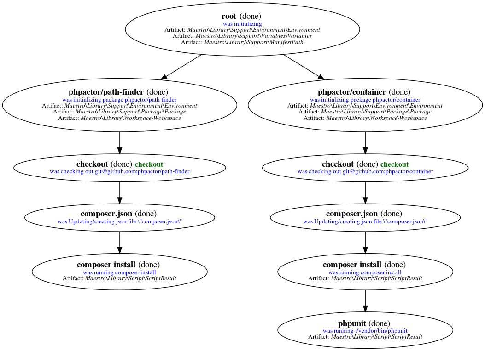

Introduction
============

Maestro is a tool for **automating package maintainence**.

It is intended for people who maintain package ecosystems - that is many
packages which are related in someway.

It can be used to:

- Syncrhonise package configuration
- Run tasks (such as test tools, migration tools, etc)
- Run your test suites
- Tag releases
- Perform surveys (e.g. the version state of a package)
- Generate reports
- Do other things...

In general it will checkout your package repositories and perform tasks on
them in parallel.

You start by creating a ``maestro.json`` configuration file:

.. literalinclude:: ../../example/project.json
   :language: json

Which is turned into a graph:

Which is executed:

.. image:: images/project_run.gif

.. note:: 

   In a real configuration we would use ``prototypes`` to avoid
   repeating configuration for each package.
